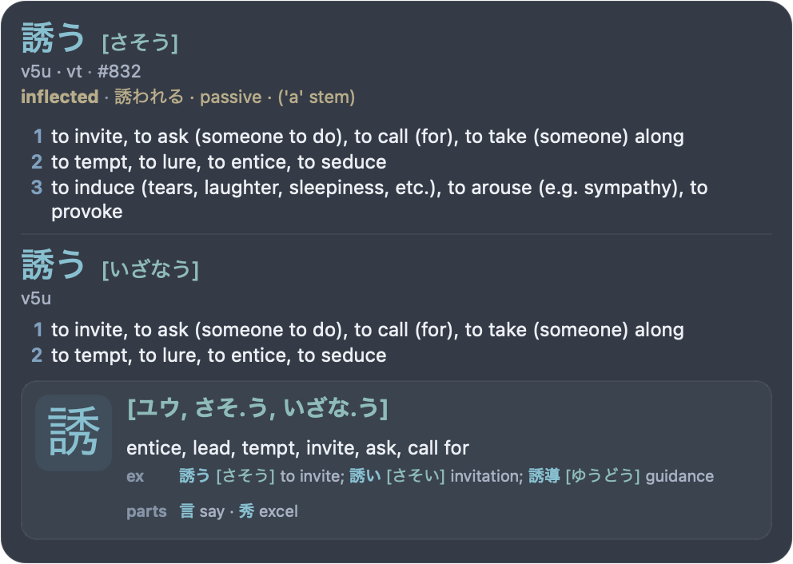

# MeikiKai

MeikiKai is a macOS menu bar OCR popup dictionary for Japanese. It uses local Chrome Screen AI OCR on the selected display, looks up the text under your cursor, and shows a compact dictionary popup.

<p align="center">
  
</p>

MeikiKai is a fork of [rtr46/meikipop](https://github.com/rtr46/meikipop). It is macOS-only.

## What it does

- Reads screen-visible Japanese text from apps, videos, visual novels, PDFs, websites, manga readers, and similar sources.
- Shows JMdict-style vocabulary entries with readings, definitions, part-of-speech, tags, frequency rank, and deconjugation details.
- Adds kanji support cards for matched text, including readings, meanings, examples, and components when available.
- Supports horizontal and vertical Japanese OCR results.
- Lets you choose the scan target: one display or all displays.
- Provides popup density controls: layout, number of entries, senses per entry, and glosses per sense.
- Uses Nord as the default popup theme, with Nazeka, Catppuccin, and Kanagawa Wave available.
- Can copy the top visible entry, open it on Jisho.org, or export it directly to Anki.
- Can optionally pause macOS Now Playing media while the popup is visible, then resume only media it paused.

## Popup layouts

Layout changes the popup width, spacing, metadata visibility, and kanji presentation. It does not change the selected theme. The default layout is Complete.

<table>
  <tr>
    <th>Compact</th>
    <th>Standard</th>
    <th>Complete (default)</th>
  </tr>
  <tr>
    <td></td>
    <td></td>
    <td></td>
  </tr>
</table>

## Popup themes

Nord is the default MeikiKai theme. Nazeka is the legacy Meikipop-style palette. Catppuccin and Kanagawa Wave are alternate dark palettes.

<table>
  <tr>
    <th>Nazeka</th>
    <th>Nord (default)</th>
  </tr>
  <tr>
    <td></td>
    <td></td>
  </tr>
  <tr>
    <th>Catppuccin</th>
    <th>Kanagawa Wave</th>
  </tr>
  <tr>
    <td></td>
    <td></td>
  </tr>
</table>

## Requirements

- macOS
- Python 3.10+ when running from source
- macOS permissions:
  - Screen Recording, so MeikiKai can read screen content for OCR
  - Accessibility, for global hotkeys/input handling
  - Input Monitoring, if macOS requests it for input hooks
- Chrome Screen AI for OCR. MeikiKai opens a setup window when it is missing, but downloads it only after you choose **Download Chrome Screen AI**. It is downloaded from Google/Chromium public infrastructure, is not bundled with MeikiKai, and can be uninstalled from Settings.
- Optional: [Anki](https://apps.ankiweb.net/) with [AnkiConnect](https://ankiweb.net/shared/info/2055492159) for direct card export.

MeikiKai stores user files here:

- App data and dictionaries: `~/Library/Application Support/meikikai/`
- Caches: `~/Library/Caches/meikikai/`
- Logs: `~/Library/Logs/MeikiKai/meikikai.log`

## Install

Download the latest macOS DMG:

<https://github.com/hectahertz/meikikai/releases/latest>

Or run from source:

```bash
git clone https://github.com/hectahertz/meikikai.git
cd meikikai
python3 -m venv .venv
source .venv/bin/activate
python -m pip install -e .
meikikai
```

On first run:

1. If `dictionary.pkl` is missing, MeikiKai downloads the default dictionary release.
2. If Chrome Screen AI is missing, MeikiKai opens OCR setup. Choose **Download Chrome Screen AI** to enable OCR.
3. Grant macOS permissions when prompted, then relaunch if macOS asks you to.

## Usage

1. Start `MeikiKai.app` or run `meikikai`.
2. Make sure OCR setup says Chrome Screen AI is ready.
3. Move the mouse over Japanese text on the selected scan screen.
4. Use the popup or shortcuts:

| Shortcut | Action |
| --- | --- |
| `Ctrl+Shift+C` | Copy the top visible vocabulary expression. |
| `Ctrl+Shift+J` | Open a Jisho.org search for the top visible vocabulary expression. |
| `Ctrl+Shift+M` | Export the top visible vocabulary entry to Anki. |

The menu bar icon provides pause, media auto-pause, settings, scan-screen selection, and quit.

## Settings

Settings are saved to `~/Library/Application Support/meikikai/config.ini`.

- **Lookup**: maximum lookup length.
- **Scanning**: OCR scan cooldown.
- **Popup**: theme, layout, entries shown, senses per entry, glosses per sense, and placement around the cursor.
- **OCR Engine**: Chrome Screen AI status, install/reinstall/update, third-party notices, and uninstall.
- **Anki**: AnkiConnect URL and whether to open the native macOS cropper before card creation.
- **Shortcuts**: read-only reminder of the global shortcuts.

## Anki export

MeikiKai can create recognition cards through AnkiConnect from the top visible vocabulary entry. Install AnkiConnect, keep Anki open, hover text until the popup is visible, then press `Ctrl+Shift+M`.

<p align="center">
  <br>
  <sub>Screenshot content from <a href="https://www.youtube.com/watch?v=u5rQn2UM37A">“45 mins N4 Japanese immersion! / Let's go cycling! #129”</a> by <a href="https://www.youtube.com/@kensanokaeri">けんさんおかえり Japanese</a>.</sub>
</p>

Export behavior:

- Uses deck `MeikiKai Mining`.
- Creates or updates note type `MeikiKai Vocab` when it can do so safely.
- Refuses unsafe note-type changes if an incompatible existing note type already contains notes.
- Adds tags `meikikai` and `meikikai-vocab`.
- Blocks duplicates using MeikiKai's `Key` field, based on entry ID, expression, and reading.
- Includes expression, reading, lookup text, highlighted sentence, definitions, part-of-speech, tags, frequency, deconjugation, kanji info, entry ID, and an optional cropped image.
- By default, opens the native macOS crop UI before adding the card. Press Esc to cancel card creation, or disable image capture in Settings.

## Dictionaries

The default dictionary is downloaded automatically if `dictionary.pkl` is missing.

Rebuild the bundled-format dictionary:

```bash
meikikai build-dict
```

Import Yomitan/Yomichan dictionaries:

```bash
meikikai import-yomitan-dict-html dict.zip
meikikai import-yomitan-dict-text dict1.zip dict2.zip
```

Imports overwrite `~/Library/Application Support/meikikai/dictionary.pkl`.

## Development

Run from source:

```bash
PYTHONPATH=src .venv/bin/python -m meikikai.main
```

Quick syntax validation:

```bash
find src scripts -name '*.py' -print0 | xargs -0 .venv/bin/python -m py_compile
```

Regenerate README images:

```bash
.venv/bin/python scripts/render_popup_sample.py readme-layouts
.venv/bin/python scripts/render_popup_sample.py readme-themes
.venv/bin/python scripts/render_anki_card_sample.py mockup back -o design/card-back.png
```

Build, install to `/Applications/MeikiKai.app`, and reopen locally:

```bash
cp .env.example .env
scripts/build_install_macos.sh
```

Optionally set `MEIKIKAI_CODESIGN_IDENTITY` in `.env` to sign the local build with a specific identity.

## Troubleshooting

- **OCR unavailable**: open Settings → OCR Engine, confirm Chrome Screen AI is installed and ready, then confirm Screen Recording permission and relaunch.
- **Hotkeys unavailable**: confirm Accessibility permission and relaunch.
- **Permissions look correct but behavior is broken after rebuilding/signing**: remove MeikiKai from the affected macOS permission list, add it again, then relaunch.
- **Anki export unavailable**: open Anki with AnkiConnect enabled, then press `Ctrl+Shift+M` again.
- **Media auto-pause does nothing**: it depends on macOS Now Playing / MediaRemote support, so not every player may report or respond consistently.
- **Need details**: check `~/Library/Logs/MeikiKai/meikikai.log`.

## License

GPL-3.0. See [LICENSE](LICENSE).
