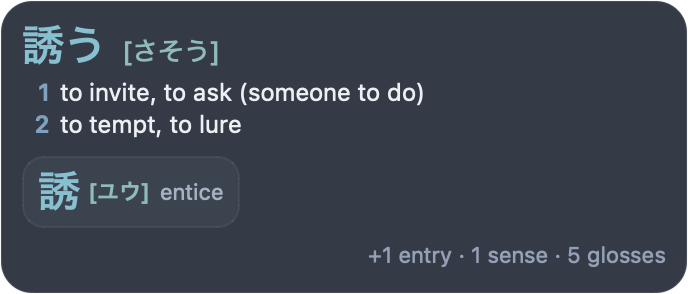
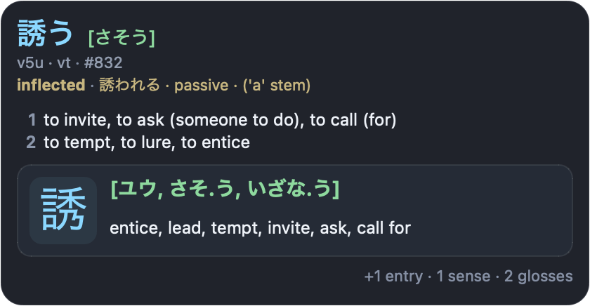
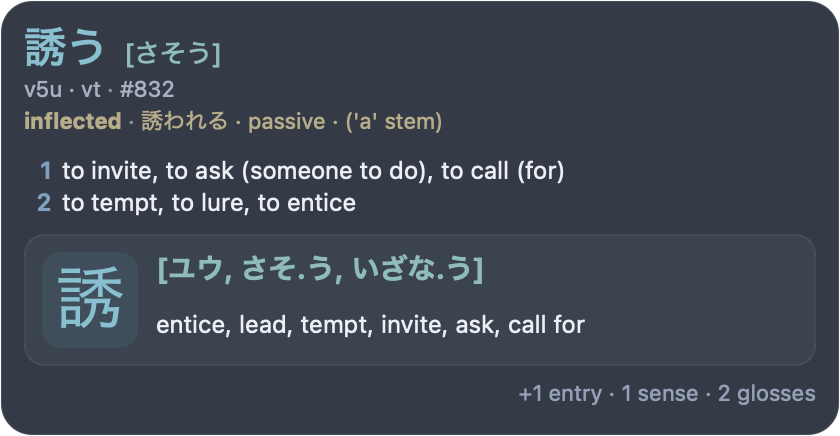
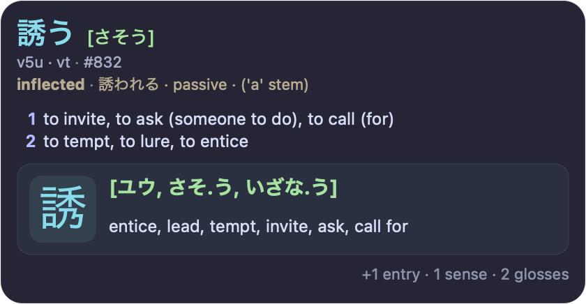
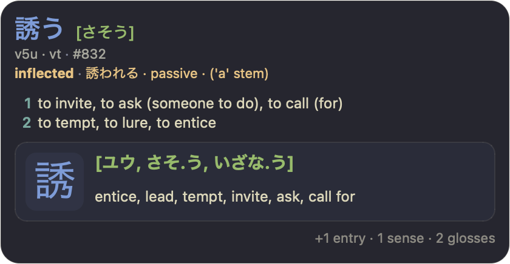

# MeikiKai

MeikiKai is a macOS Japanese OCR popup dictionary. Hover over Japanese text anywhere on screen to see dictionary entries, kanji details, and deconjugation results.

<p align="center">
  
</p>

Forked from [rtr46/meikipop](https://github.com/rtr46/meikipop).

## Highlights

- **Redesigned dark popup** with kanji cards, frequency, tags, and deconjugation details.
- **Configurable popup themes and layouts** for compact, balanced, or complete dictionary detail.
- **Cleaner settings window** for lookup, scanning, popup theme/layout, popup placement, and AnkiConnect.
- **macOS-only app flow** with menu bar controls and popup behavior that works across fullscreen apps and Spaces.
- **One-display or all-displays scanning** from the menu bar.
- **Optional media auto-pause** while dictionary results are visible.
- **Direct Anki export** through AnkiConnect, with automatic deck/note type setup and optional screenshots.

## Popup layouts

Choose how much structure the popup shows without changing the core text scale. Layout controls the popup shape and kanji presentation. Entry, sense, and gloss counts are separate settings.

<table>
  <tr>
    <th>Compact</th>
    <th>Standard</th>
    <th>Complete</th>
  </tr>
  <tr>
    <td></td>
    <td></td>
    <td></td>
  </tr>
</table>

## Popup themes

Nord is the default popup theme. Nazeka follows the Meikipop/MeikiKai default style, while Catppuccin and Kanagawa Wave offer editor-inspired alternatives.

<table>
  <tr>
    <th>Nazeka</th>
    <th>Nord (default)</th>
    <th>Catppuccin</th>
    <th>Kanagawa Wave</th>
  </tr>
  <tr>
    <td></td>
    <td></td>
    <td></td>
    <td></td>
  </tr>
</table>

## Direct Anki export

Create Anki recognition cards from the visible top vocabulary entry, with popup-style details and optional cropped screenshots.

<p align="center">
  <br>
  <sub>Screenshot content from <a href="https://www.youtube.com/watch?v=FV1uXLlfN20">“1 hour Japanese immersion: Comprehensible Listening Practice! N5-N3 #149”</a> by <a href="https://www.youtube.com/@kensanokaeri">けんさんおかえり Japanese</a>.</sub>
</p>

## Features

- Works anywhere text is visible: games, visual novels, manga, videos, PDFs, websites, and more.
- Uses local Japanese OCR through Chrome Screen AI.
- Supports horizontal and vertical Japanese text.
- Looks up vocabulary with JMdict-style senses, deconjugation, frequency rank, part-of-speech, and tags.
- Shows kanji details, readings, meanings, examples, and components.
- Lets you choose Nazeka, Nord, Catppuccin, or Kanagawa Wave themes, plus Compact, Standard, or Complete popup layout.
- Lets you set visible entries, senses, and glosses independently.
- Imports Yomitan/Yomichan dictionaries.
- Scans one selected display or all displays.
- Stays visible across macOS Spaces and fullscreen apps.
- Runs from the macOS menu bar with pause, settings, screen selection, and quit controls.
- Can pause currently playing macOS media while the popup is visible, then resume it afterward.
- Copies the visible top vocabulary expression to the clipboard with `Ctrl+Shift+C`.
- Opens a Jisho.org search for the visible top vocabulary expression with `Ctrl+Shift+J`.
- Adds the visible top vocabulary entry directly to Anki through AnkiConnect, with optional cropped screenshots on cards.

## Requirements

- macOS
- Python 3.10+ when running from source
- macOS permissions:
  - Screen Recording, for OCR screenshots
  - Accessibility, for global hotkeys
  - Input Monitoring, if macOS requests it for input hooks
- Required for OCR: Chrome Screen AI, installed only after you opt in from MeikiKai's OCR Setup UI. It is downloaded from Google/Chromium public infrastructure, is not bundled with MeikiKai, and can be removed later.
- Optional for Anki export: [Anki](https://apps.ankiweb.net/) with [AnkiConnect](https://ankiweb.net/shared/info/2055492159)

App data is stored in `~/Library/Application Support/meikikai/`.
Caches are stored in `~/Library/Caches/meikikai/`.
Logs are stored in `~/Library/Logs/MeikiKai/meikikai.log`.

## Install

Download the latest macOS release DMG:

<https://github.com/hectahertz/meikikai/releases/latest>

Or run from source:

```bash
git clone https://github.com/hectahertz/meikikai.git
cd meikikai
python3 -m venv .venv
source .venv/bin/activate
python -m pip install -e .
meikikai
```

The default dictionary is downloaded on first run if `dictionary.pkl` is missing.

On first launch, MeikiKai opens OCR Setup if Chrome Screen AI is missing. MeikiKai does not bundle or automatically download Chrome Screen AI. Choose **Download Chrome Screen AI…** to enable OCR. After installation, the same setup window provides reinstall/update, notices, and uninstall actions.

## Usage

1. Start `MeikiKai.app` or run `meikikai`.
2. Grant macOS permissions when prompted.
3. Move the mouse over Japanese text on the selected screen.
4. Press `Ctrl+Shift+C` to copy the visible top vocabulary expression, `Ctrl+Shift+J` to search it on Jisho.org, or `Ctrl+Shift+M` to export it to Anki.
5. Use the menu bar icon to pause, enable media auto-pause, open settings, choose the scan screen, or quit.

### Settings

Settings are saved to `~/Library/Application Support/meikikai/config.ini`.

- **Maximum lookup length**: how many OCR characters are kept before dictionary lookup.
- **Scan cooldown**: minimum delay between OCR scans.
- **Popup theme**: choose Nazeka, Nord, Catppuccin, or Kanagawa Wave. Nord is the default.
- **Popup layout**: choose Compact, Standard, or Complete. Complete preserves the full default popup.
- **Entries shown**: choose how many vocabulary entries appear before the omitted-entry footer.
- **Senses per entry**: choose how many numbered definition groups appear for each vocabulary entry.
- **Glosses per sense**: choose how many comma-separated translation glosses appear inside each sense.
- **Popup placement**: choose visual novel mode or flipped placement around the cursor.
- **OCR Engine**: install, reinstall/update, inspect, view notices for, or uninstall the Chrome Screen AI component used by OCR.
- **AnkiConnect URL**: defaults to `http://127.0.0.1:8765`.
- **Capture screenshot**: opens the native macOS cropper before Anki card creation; Esc cancels card creation. Disable this to add cards without screenshots.

### Anki export

MeikiKai can create Anki cards directly through AnkiConnect.

1. Install AnkiConnect in Anki.
2. Keep Anki open.
3. Hover text until the popup is visible.
4. Press `Ctrl+Shift+M`.

Export behavior:

- Exports only the top visible vocabulary entry.
- Creates deck `MeikiKai Mining` automatically.
- Creates or updates note type `MeikiKai Vocab` automatically when safe.
- Uses a recognition card with the sentence on the front and popup-style details on the back.
- By default, opens the native macOS screenshot cropper before adding the card; pressing Esc cancels card creation. Disable this in Settings to add cards without screenshots.
- Includes expression, reading, lookup text, highlighted sentence, optional screenshot, definitions, part of speech, tags, frequency, deconjugation, kanji info, and entry ID fields.
- Adds tags `meikikai` and `meikikai-vocab`.
- Blocks duplicate cards by MeikiKai's first `Key` field, which combines the entry ID, expression, and reading.

## Dictionary commands

Rebuild the bundled-format dictionary:

```bash
meikikai build-dict
```

Import Yomitan/Yomichan dictionaries:

```bash
meikikai import-yomitan-dict-html dict.zip
meikikai import-yomitan-dict-text dict1.zip dict2.zip
```

Imports overwrite `~/Library/Application Support/meikikai/dictionary.pkl`.

## Development

Regenerate the README popup images:

```bash
.venv/bin/python scripts/render_popup_sample.py readme-layouts
.venv/bin/python scripts/render_popup_sample.py readme-themes
```

Render popup layout option samples and contact sheet for UI review:

```bash
.venv/bin/python scripts/render_popup_sample.py layout-options
```

Render popup theme previews with Compact, Standard, and Complete samples:

```bash
.venv/bin/python scripts/render_popup_sample.py themes
```

Render Anki card samples for UI review:

```bash
.venv/bin/python scripts/render_anki_card_sample.py mockup both -o /tmp/meikikai_anki_card_mockup.png
.venv/bin/python scripts/render_anki_card_sample.py mockup back -o design/card-back.png
```

Quick syntax validation:

```bash
find src scripts -name '*.py' -print0 | xargs -0 .venv/bin/python -m py_compile
```

Build the macOS app:

```bash
.venv/bin/python -m pip install pyinstaller
.venv/bin/python -m PyInstaller -y meikikai.macos.spec
```

Build, install to `/Applications/MeikiKai.app`, and reopen locally:

```bash
.venv/bin/python -m pip install pyinstaller
cp .env.example .env
scripts/build_install_macos.sh
```

Optionally set `MEIKIKAI_CODESIGN_IDENTITY` in `.env` to re-sign the local build with a specific identity.

## Troubleshooting

- If OCR does not work, open Settings from the menu bar, manage the OCR Engine section, and confirm Chrome Screen AI is installed and ready. Then confirm Screen Recording permission for MeikiKai and relaunch the app.
- If global hotkeys do not work, confirm Accessibility permission and relaunch.
- After rebuilding or re-signing the app, macOS permissions can become stale. Remove MeikiKai from the affected permission list, add it again, then relaunch.
- If Anki export says Anki is unavailable, open Anki with AnkiConnect enabled and try `Ctrl+Shift+M` again.
- Check logs at `~/Library/Logs/MeikiKai/meikikai.log`.

## License

GPL-3.0. See [LICENSE](LICENSE).
