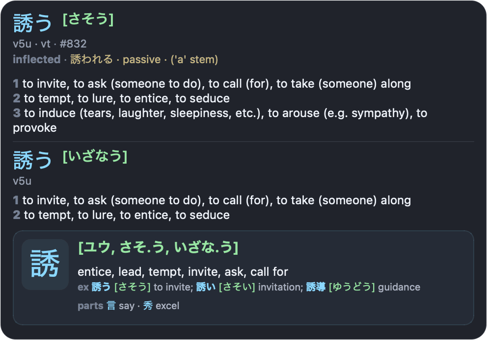
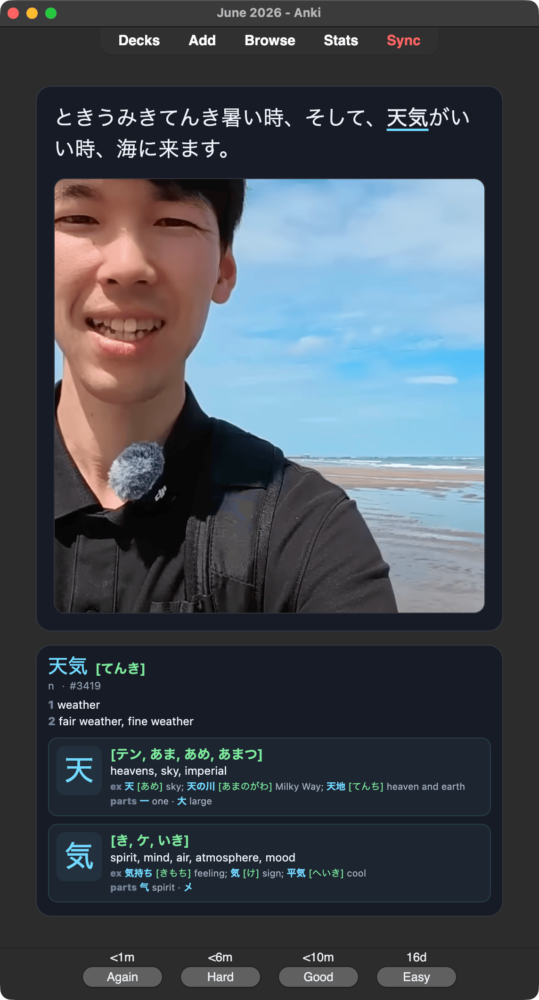

# MeikiKai

MeikiKai is a macOS Japanese OCR popup dictionary. Hover Japanese text anywhere on screen to see dictionary entries, kanji details, and deconjugation results.

<p align="center">
  
</p>

Forked from [rtr46/meikipop](https://github.com/rtr46/meikipop).

## MeikiKai highlights

- **Dark redesigned popup** with kanji cards, frequency, tags, and deconjugation details.
- **Cleaner settings window** for lookup, scanning, popup placement, and AnkiConnect.
- **macOS-only app flow** with menu bar controls and fullscreen/Spaces-friendly popup behavior.
- **One-display or all-displays scanning** from the menu bar.
- **Optional media auto-pause** while dictionary results are visible.
- **Direct Anki export** through AnkiConnect with automatic deck/note type setup and optional screenshot images.

## Direct Anki export

Create Anki recognition cards from the visible top vocabulary entry, with popup-style details and optional cropped screenshots.

<p align="center">
  <br>
  <sub>Screenshot content from <a href="https://www.youtube.com/watch?v=FV1uXLlfN20">“1 hour Japanese immersion: Comprehensible Listening Practice! N5-N3 #149”</a> by <a href="https://www.youtube.com/@kensanokaeri">けんさんおかえり Japanese</a>.</sub>
</p>

## Features

- Works anywhere text is visible: games, visual novels, manga, videos, PDFs, websites, and more.
- Uses local Japanese OCR through `meikiocr`.
- Supports horizontal and vertical Japanese text.
- Looks up vocabulary with JMdict-style senses, deconjugation, frequency rank, part-of-speech, and tags.
- Shows kanji details, readings, meanings, examples, and components.
- Imports Yomitan/Yomichan dictionaries.
- Scans one selected display or all displays.
- Stays visible across macOS Spaces and fullscreen apps.
- Runs from the macOS menu bar with pause, settings, screen selection, and quit controls.
- Can pause currently playing macOS media while the popup is visible, then resume it afterward.
- Adds the visible top vocabulary entry directly to Anki through AnkiConnect, with optional cropped screenshots on cards.

## Requirements

- macOS
- Python 3.10+ when running from source
- macOS permissions:
  - Screen Recording, for OCR screenshots
  - Accessibility, for global hotkeys and media automation
  - Input Monitoring, if macOS requests it for input hooks
- Optional for Anki export: [Anki](https://apps.ankiweb.net/) with [AnkiConnect](https://ankiweb.net/shared/info/2055492159)

App data is stored in `~/Library/Application Support/meikikai/`.
Caches are stored in `~/Library/Caches/meikikai/`.
Logs are stored in `~/Library/Logs/MeikiKai/meikikai.log`.

## Install

Download the latest macOS release DMG:

<https://github.com/hectahertz/meikikai/releases/latest>

Or run from source:

```bash
git clone https://github.com/hectahertz/meikikai.git
cd meikikai
python3 -m venv .venv
source .venv/bin/activate
python -m pip install -e .
meikikai
```

The default dictionary is downloaded on first run if `dictionary.pkl` is missing.

## Usage

1. Start `MeikiKai.app` or run `meikikai`.
2. Grant macOS permissions when prompted.
3. Move the mouse over Japanese text on the selected screen.
4. Use the menu bar icon to pause, enable media auto-pause, open settings, choose the scan screen, or quit.

### Settings

Settings are saved to `~/Library/Application Support/meikikai/config.ini`.

- **Maximum lookup length**: how many OCR characters are kept before dictionary lookup.
- **Scan cooldown**: minimum delay between OCR scans.
- **Popup placement**: choose visual novel mode or flipped placement around the cursor.
- **AnkiConnect URL**: defaults to `http://127.0.0.1:8765`.
- **Capture screenshot**: opens the native macOS cropper before Anki card creation; Esc cancels card creation. Disable this to add cards without screenshots.

### Anki export

MeikiKai can create Anki cards directly through AnkiConnect.

1. Install AnkiConnect in Anki.
2. Keep Anki open.
3. Hover text until the popup is visible.
4. Press `Ctrl+Shift+M`.

Export behavior:

- Exports only the top visible vocabulary entry.
- Creates deck `MeikiKai Mining` automatically.
- Creates or updates note type `MeikiKai Vocab` automatically when safe.
- Uses a recognition card with the sentence on the front and popup-style details on the back.
- By default, opens the native macOS screenshot cropper before adding the card; pressing Esc cancels card creation. Disable this in Settings to add cards without screenshots.
- Includes expression, reading, lookup text, highlighted sentence, optional screenshot, definitions, part of speech, tags, frequency, deconjugation, kanji info, and entry ID fields.
- Adds tags `meikikai` and `meikikai-vocab`.
- Blocks duplicate cards by the first `Key` field.

## Dictionary commands

Rebuild the bundled-format dictionary:

```bash
meikikai build-dict
```

Import Yomitan/Yomichan dictionaries:

```bash
meikikai import-yomitan-dict-html dict.zip
meikikai import-yomitan-dict-text dict1.zip dict2.zip
```

Imports overwrite `~/Library/Application Support/meikikai/dictionary.pkl`.

## Development

Regenerate the README popup image:

```bash
.venv/bin/python scripts/render_popup_sample.py mockup -o design/meikikai_popup_mockup.png
```

Render Anki card samples for UI review:

```bash
.venv/bin/python scripts/render_anki_card_sample.py mockup both -o /tmp/meikikai_anki_card_mockup.png
.venv/bin/python scripts/render_anki_card_sample.py mockup back -o design/card-back.png
```

Quick syntax validation:

```bash
find src scripts -name '*.py' -print0 | xargs -0 .venv/bin/python -m py_compile
```

Build the macOS app:

```bash
.venv/bin/python -m PyInstaller -y meikikai.macos.spec
```

Build, install to `/Applications/MeikiKai.app`, and reopen locally:

```bash
cp .env.example .env
scripts/build_install_macos.sh
```

Optionally set `MEIKIKAI_CODESIGN_IDENTITY` in `.env` to re-sign the local build with a specific identity.

## Troubleshooting

- If OCR does not work, confirm Screen Recording permission for MeikiKai and relaunch the app.
- If the Anki hotkey or media automation does not work, confirm Accessibility permission and relaunch.
- After rebuilding or re-signing the app, macOS permissions can become stale. Remove MeikiKai from the affected permission list, add it again, then relaunch.
- If Anki export says Anki is unavailable, open Anki with AnkiConnect enabled and try `Ctrl+Shift+M` again.
- Check logs at `~/Library/Logs/MeikiKai/meikikai.log`.

## License

GPL-3.0. See [LICENSE](LICENSE).
